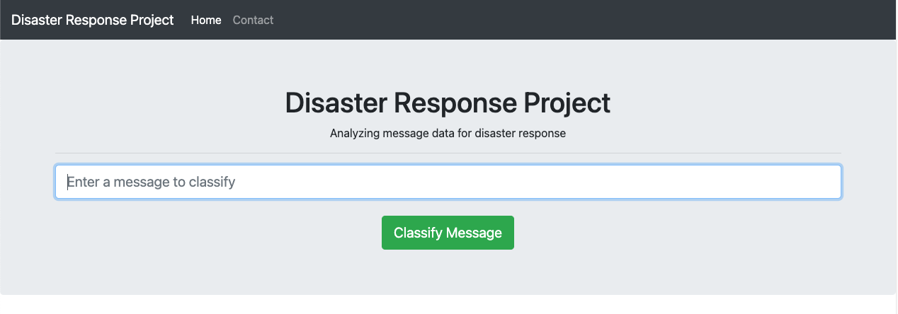
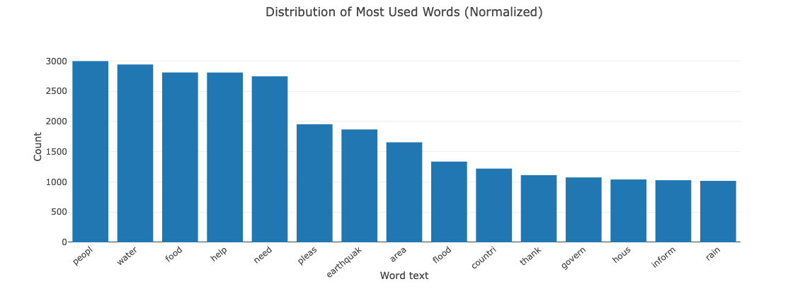
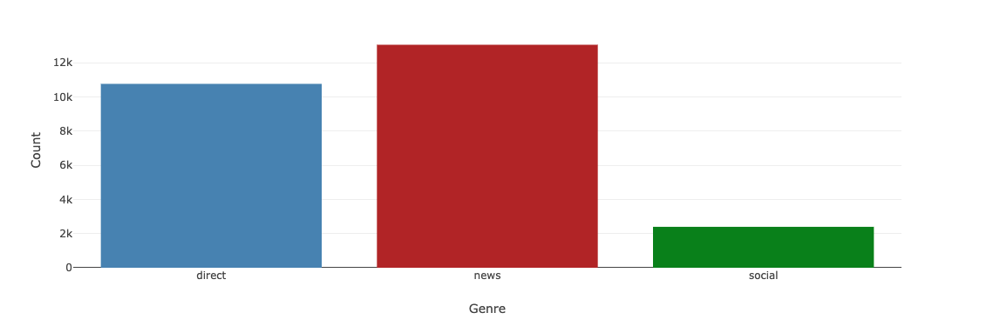
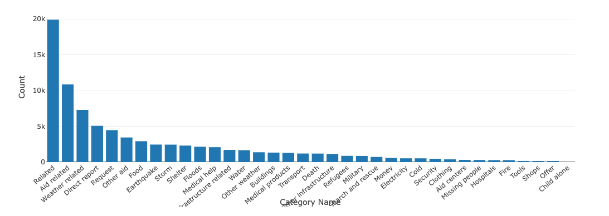
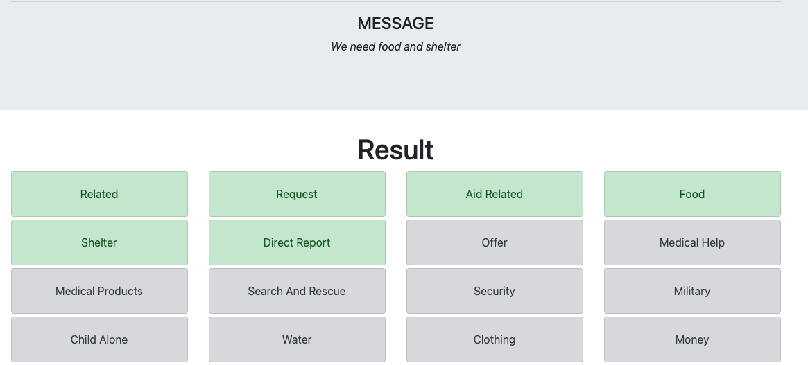

# Disaster Response Pipeline Project

### Table of Contents

1. [Installation](#installation)
2. [Instructions](#instruction)
3. [Project Steps and Motivation](#steps)
4. [Data](#data)
5. [Results](#results)
6. [Licensing, Authors, and Acknowledgements](#licensing)

## Installation 

For this project make sure that you have the Poetry library installed so everything works as expected.

If you don't have it just use this command:

`pip install poetry`

After installing poetry you just need to use this command to install the necessary libraries for the project:

`poetry install`

These are the libraries used for this project:

* python = "^3.7.9"
* Flask = "^2.0.2"
* nltk = "^3.6.4"
* pandas = "^1.3.3"
* plotly = "^5.3.1"
* scikit-learn = "^1.0"
* SQLAlchemy = "^1.4.25"

### Instructions 
1. Run the following commands in the project's root directory to set up your database and model.

    - To run ETL pipeline that cleans data and stores in database
        `python data/process_data.py data/disaster_messages.csv data/disaster_categories.csv data/DisasterResponse.db`
    - To run ML pipeline that trains classifier and saves
        `python models/train_classifier.py data/DisasterResponse.db models/classifier.pkl`

2. Run the following command in the root directory to run your web app.
    `cd app/ && python run.py`

3. Go to http://0.0.0.0:3001/

4. Try to enter messages such as "We need food and shelter" and click on Classify Message to understand and what category the message will be classified.

### Project Steps and Motivation 

This is a project focused on classifying tweets that are labeled according to real world disasters. Beyond that it has a real-time classifier for those that want to test messages.

This project consists of three steps:

1. ETL Pipeline
2. ML Pipeline
3. Run Web Application

The ETL pipeline will process the .csv files and save the processes data into a database.
The ML pipline will connect to the sqlite database created on the previous step and run a Pipeline with transformers and a classifier to create the pickle file for the trained model.
The Web Application will provide the interface to run the model trained on the ML pipeline step.

Web Application consists of:

Figure 1. Web Application Home page with Input field

Figure 2. Distribution of the most used words on the dataset

Figure 3. Distribution of the message genres

Figure 4. Distribution of the categories on the dataset

Figure 5. Result of a query into the input field. "We need food and shelter"

## Data 

The data for this project was provided by Figure8 in partnership with Udacity. And is a compiled of Tweets and its categories from real world disasters.

## Licensing, Authors, Acknowledgements

Figure Eight provided the dataset and the challenge for this project.
Udacity for the course project.
If you want to chat about this analysis or other approaches you can find me on [Twitter](https://twitter.com/python_byte).

